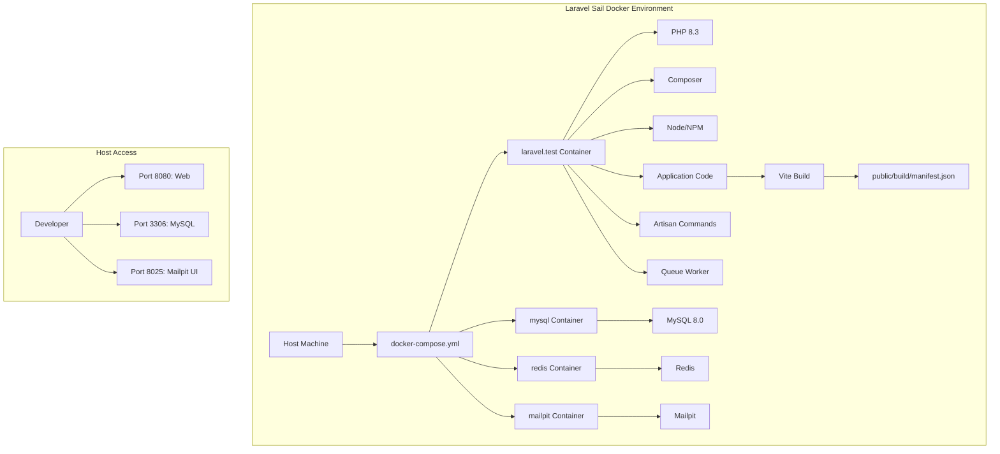

# Laravel Sail Standardization Plan

## Current State Analysis

### Project Overview
- **Laravel Version**: 12.x (based on composer.json)
- **PHP Version**: ^8.2 (composer.json requirement)
- **Frontend**: Vite with Livewire/Flux
- **Database**: MySQL (configured in .env)
- **Current Issue**: Custom Docker setup is broken, missing Node/Vite manifest

### Current Configuration
1. **Sail Dependency**: Already installed (`laravel/sail: ^1.52` in composer.json)
2. **Sail Binary**: Available at `vendor/bin/sail`
3. **Environment**: `.env` configured for MySQL with:
   - DB_HOST=mysql
   - DB_DATABASE=scotelaro
   - DB_USERNAME=scotelaro
   - DB_PASSWORD=password
4. **No Existing Docker Files**: No Dockerfile or docker-compose.yml in root

## Implementation Plan

### Phase 1: Sail Installation & Configuration

#### Step 1: Generate Sail Configuration
```bash
./vendor/bin/sail install --with=mysql
```

**Expected Outcomes:**
- Creates `docker-compose.yml` with MySQL service
- Creates `.env` Sail-specific variables (optional)
- Sets up Laravel Sail default configuration

#### Step 2: Verify Generated docker-compose.yml
Check that the generated file includes:
- `laravel.test` service (PHP 8.2/8.3)
- `mysql` service (MySQL 8.0)
- `redis` service (optional)
- `mailpit` service (optional)
- `selenium` service (NOT included per requirements)

### Phase 2: Container Build & Startup

#### Step 3: Build Sail Containers
```bash
./vendor/bin/sail build --no-cache
```

**Alternative:** Use standard startup which builds automatically:
```bash
./vendor/bin/sail up -d
```

#### Step 4: Verify Container Health
```bash
./vendor/bin/sail ps
./vendor/bin/sail logs
```

### Phase 3: Application Setup & Vite Manifest Fix

#### Step 5: Install NPM Dependencies
```bash
./vendor/bin/sail npm install
```

**Note:** This runs `npm install` inside the Sail container where Node is available.

#### Step 6: Build Frontend Assets
```bash
./vendor/bin/sail npm run build
```

**Expected Outcome:** Generates Vite manifest at `public/build/manifest.json`

#### Step 7: Verify Vite Manifest
Check for:
- `public/build/manifest.json` existence
- Asset files in `public/build/` directory
- No "Vite manifest not found" errors

### Phase 4: Database & Application Testing

#### Step 8: Run Database Migrations
```bash
./vendor/bin/sail artisan migrate --force
```

#### Step 9: Test Application Functionality
1. **Basic Health Check:**
   ```bash
   ./vendor/bin/sail artisan route:list
   ./vendor/bin/sail artisan tinker --execute="echo app()->version();"
   ```

2. **Web Server Test:**
   ```bash
   ./vendor/bin/sail artisan serve &
   curl http://localhost:8000
   ```

3. **Vite Manifest Verification:**
   - Access a page that uses Vite assets
   - Check browser console for 404 errors

### Phase 5: Documentation & Cleanup

#### Step 10: Update Documentation
- Add Sail usage instructions to README.md
- Document common Sail commands
- Note any environment-specific configurations

#### Step 11: Verify Complete Setup
- All containers running (`sail ps`)
- Application accessible
- No Vite manifest errors
- Database connections working

## Service Configuration Details

### Required Services in docker-compose.yml
1. **laravel.test** - PHP 8.2/8.3 with required extensions
2. **mysql** - MySQL 8.0 database
3. **redis** - Optional caching (if configured)
4. **mailpit** - Optional email testing

### Port Mappings
- **Application**: 80 (container) → 8080 (host) typically
- **MySQL**: 3306 (container) → 3306 (host)
- **Mailpit**: 1025/8025 (if included)

### Volume Mounts
- Application code: `.:/var/www/html`
- MySQL data: `sail-mysql:/var/lib/mysql`
- Composer cache: `sail-composer-cache:/tmp/composer-cache`
- NPM cache: `sail-npm-cache:/tmp/npm-cache`

## Risk Mitigation

### Potential Issues & Solutions

1. **Port Conflicts**
   - **Issue**: Port 8080/3306 already in use
   - **Solution**: Modify `APP_PORT` in .env or docker-compose.yml ports

2. **Permission Issues**
   - **Issue**: File permissions between host and container
   - **Solution**: Ensure proper ownership, use Sail's built-in user mapping

3. **Vite Manifest Still Missing**
   - **Issue**: `npm run build` doesn't generate manifest
   - **Solution**: 
     - Check `vite.config.js` configuration
     - Verify Node version in container
     - Clear cache: `sail npm run build --force`

4. **Database Connection Errors**
   - **Issue**: Can't connect to MySQL
   - **Solution**: 
     - Verify `.env` DB_HOST matches service name (`mysql`)
     - Check MySQL container logs
     - Ensure database exists

## Success Criteria

1. ✅ `docker-compose.yml` generated with MySQL service
2. ✅ All Sail containers build and start successfully
3. ✅ `npm install` and `npm run build` complete without errors
4. ✅ Vite manifest file exists at `public/build/manifest.json`
5. ✅ Application accessible via web browser
6. ✅ Database migrations run successfully
7. ✅ No "Vite manifest not found" errors

## Next Steps After Implementation

1. **Development Workflow**:
   - Use `./vendor/bin/sail artisan ...` for all artisan commands
   - Use `./vendor/bin/sail npm ...` for frontend commands
   - Use `./vendor/bin/sail composer ...` for composer commands

2. **Testing**:
   - Run tests inside Sail: `./vendor/bin/sail test`
   - Use PestPHP as configured

3. **Deployment Considerations**:
   - Sail is for local development only
   - Production requires different Docker/Deployment strategy

## Mermaid Diagram: Sail Architecture



## Command Reference

### Essential Sail Commands
```bash
# Start services
./vendor/bin/sail up -d

# Stop services
./vendor/bin/sail down

# Run artisan commands
./vendor/bin/sail artisan migrate
./vendor/bin/sail artisan tinker

# Run composer commands
./vendor/bin/sail composer require package

# Run npm commands
./vendor/bin/sail npm install
./vendor/bin/sail npm run dev

# View logs
./vendor/bin/sail logs
./vendor/bin/sail logs -f

# Shell access
./vendor/bin/sail shell
./vendor/bin/sail root-shell

# Database access
./vendor/bin/sail mysql
```

### Project-Specific Commands
```bash
# Setup (after Sail installation)
./vendor/bin/sail artisan migrate --force
./vendor/bin/sail npm install
./vendor/bin/sail npm run build

# Development
./vendor/bin/sail npm run dev
./vendor/bin/sail artisan queue:work

# Testing
./vendor/bin/sail test
./vendor/bin/sail pint
```

## Final Verification Checklist

- [ ] `docker-compose.yml` exists with MySQL service
- [ ] Containers are running (`sail ps` shows all services up)
- [ ] Application responds at http://localhost:8080
- [ ] `public/build/manifest.json` exists
- [ ] Database migrations have run
- [ ] Artisan commands work inside Sail
- [ ] NPM commands work inside Sail
- [ ] No errors in container logs
